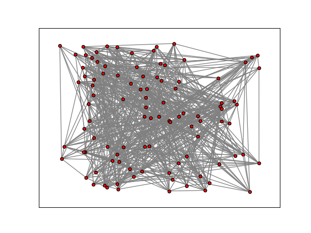
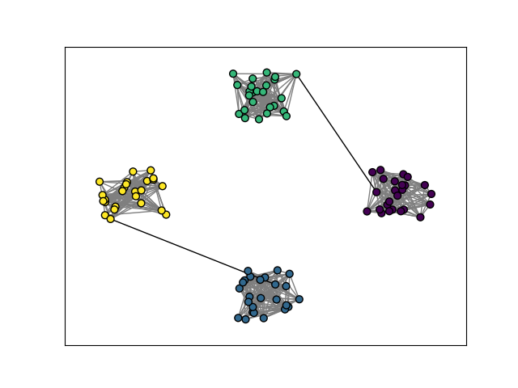

# Graph Partitioning Using A Discrete Quadratic Model

A demo of Graph Partitioning using Leap's hybrid discrete quadratic model (DQM) solver.



The figure above shows the graph we want to partition.

We want to partition this graph so that there are as few links between
partitions as possible, and so that the partitions have equal size.
This is a [well-known problem](https://en.wikipedia.org/wiki/Graph_partition) which is already in the [D-Wave Collection of Examples](https://github.com/dwave-examples/graph-partitioning). In this repo, we're going to use the D-Wave DQM 
solver.

## Usage

To run the demo:

```bash
python graph_partitioning.py
```

The program will produce a solution which might look like this:

```
Solution:  {0: 4, 1: 0, 2: 2, 3: 4, 4: 4, 5: 1, 6: 3, 7: 1, 8: 0, 9: 4, 10: 3, 11: 1, 12: 2, 13: 3, 14: 3, 15: 0, 16: 1, 17: 2, 18: 1, 19: 3, 20: 2, 21: 2, 22: 0, 23: 3, 24: 4, 25: 0, 26: 2, 27: 1, 28: 0, 29: 4}
Solution energy with offset included:  134.0
Counts in each partition:  [6. 6. 6. 6. 6.]
Number of links between partitions:  67
```

and when the solution is drawn:



we see that the partitions have equal size. The code counts the number of links
between partitions. An image showing the partitions is saved as
`graph_partition_result.png`.

## Code Overview

As noted earlier, the Graph Partitioning problem is in the [D-Wave Collection of Examples](https://github.com/dwave-examples/graph-partitioning), but there it is formulated for 2 partitions. In this repo, we're going to use the D-Wave DQM solver, and the formulation will be for `K` partitions.

The code implements a QUBO formulation of this problem, which is suitable for implementing on the DQM solver.

The answer that we are looking for is a partition of the nodes in the graph, so
we will assign a DQM variable for each node, i.e. variable 

denotes whether node `i` is in subset `k` or not.

Our objective function should minimize the number of 
links between different partitions. To
count how many links between different partitions we have, 
given a partition of the nodes (assignment of our binary variables), 
we start with a single edge. We begin by considering the possibilities
if this edge is in, or not in, partition `k`. The table below shows the
four possibilities. We want either both nodes to be in partition `k`, or 
neither node to be in partition `k`. To accomplish this, we assign a 1
in the edge column if one node is in partition `k` and the other node is not.

|  |  | edge (i,j) |
| :---: | :---: | :---: |
| 0 | 0 | 0 |
| 0 | 1 | 1 |
| 1 | 0 | 1 |
| 1 | 1 | 0 |

From this table, we see that we can use the expression 

to calculate the edge column in our table. 
The minimum value of the expression is for partitions with as many as possible
of the graph's edges found between nodes in those partitions. When we utilize
this expression over all partitions and all edges, we will maximize the number 
of intra-partition edges, and that will minimize the number of links
between different partitions. Thus, for the entire graph, our objective
function can be written as shown below:


where we have divided by 2 to avoid double-counting when an edge's nodes are 
in different partitions.

Next we need to consider our constraint:  Each partition must have the
same size.  We can measure the size of partition `k` by summing up our binary
variables associated with partition `k` (for example, 
,
, ...).
To ensure that all of the partitions have the same size, we enforce a
constraint that partition `k` has size equal to `N`/`K`, where `N` is the number
of nodes in the graph and `K` is the number of partitions.
We represent this constraint mathematically using our chosen
binary variables as follows:


This will have its minimum when each partition has `N`/`K`  nodes.

We bring the objective and constraints together by multiplying the 
constraints by ,
 the [Lagrange parameter](https://en.wikipedia.org/wiki/Lagrange_multiplier).


There are algebraic simplifications that can be performed on this sum.
Multiplying the second term out, we find:


and then the constant (last term) is the energy offset, which gives us:


and expanding the squared sum,


and we can merge the linear terms,


and we can move the quadratic terms together,


Now, the second term in the QUBO can be simplified if we realize that variables such as  will
appear as many times as node `i` appears in the graph, which is the
degree of node `i` in the graph. Our QUBO thus reduces to:


Leap's DQM solver accepts problems expressed in terms of an
Ocean [DiscreteQuadraticModel](https://docs.ocean.dwavesys.com/en/stable/docs_dimod/reference/dqm.html) object.
The DiscreteQuadraticModel has two types of bias:

* linear biases
* quadratic biases

We want to define these two biases so that a low-energy solution found by the DQM solver will correspond to a solution of the graph partitioning problem.

The QUBO has five terms. The first term is the energy offset, as mentioned
earlier. The second and third terms are linear biases, and the fourth and
fifth terms are quadratic biases.

### Linear Biases

The linear biases have contributions from both the objective and the
constraints. The contribution from the objective, the second term in the QUBO,
 reduced earlier to an expression involving the degree of each node in the 
graph. The contribution from the constraints, the third term in the QUBO,
is a constant for all nodes and partitions.

### Quadratic Biases

The quadratic biases also have contributions from both the objective and the
constraints. The fourth term in the QUBO, from the objective, applies only
to edges in the graph. The fifth term in the QUBO, from the constraints,
applies to all nodes. Therefore, in the code, the quadratic bias calculations
need to distinguish node pairs which are not edges from those which are edges.

## Code Specifics

Let's go through the sections of code in the graph partitioning problem:

* Define the graph
* Initialize the DQM object
* Set the [Lagrange parameter](https://en.wikipedia.org/wiki/Lagrange_multiplier)
* Define the linear biases
* Define the quadratic biases
* Solve the problem using the DQM solver
* Count the number of links between partitions

## License

Released under the Apache License 2.0. See [LICENSE](LICENSE) file.
